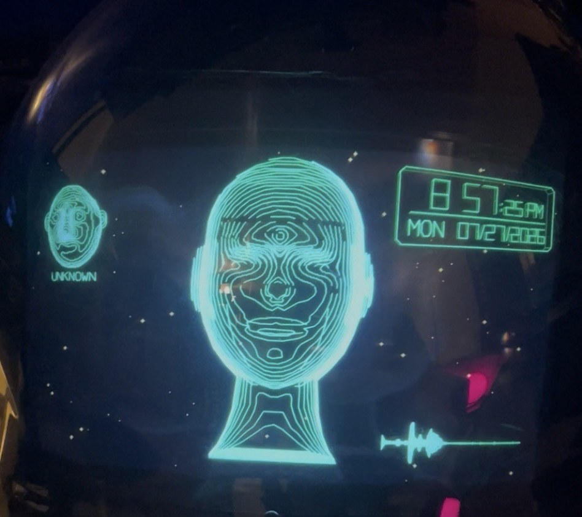
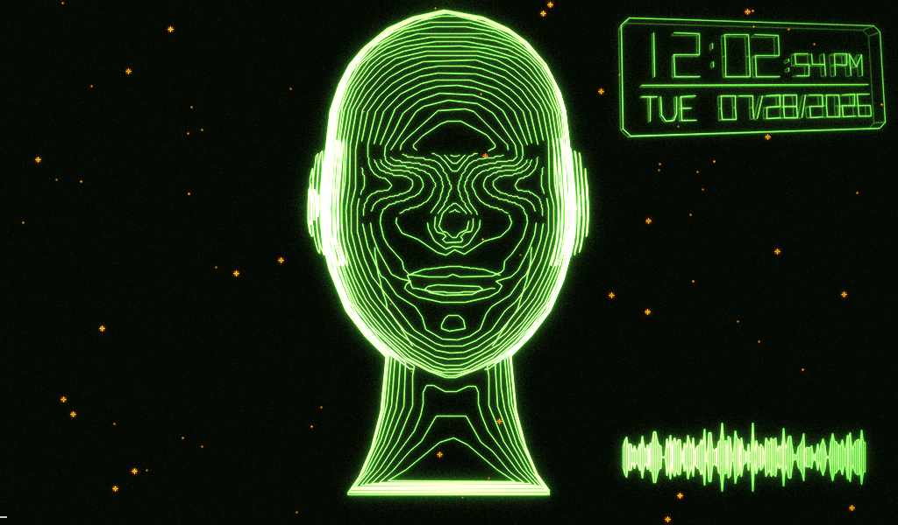
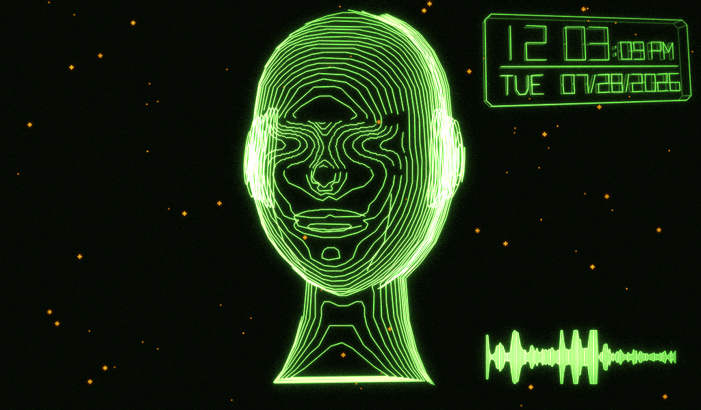
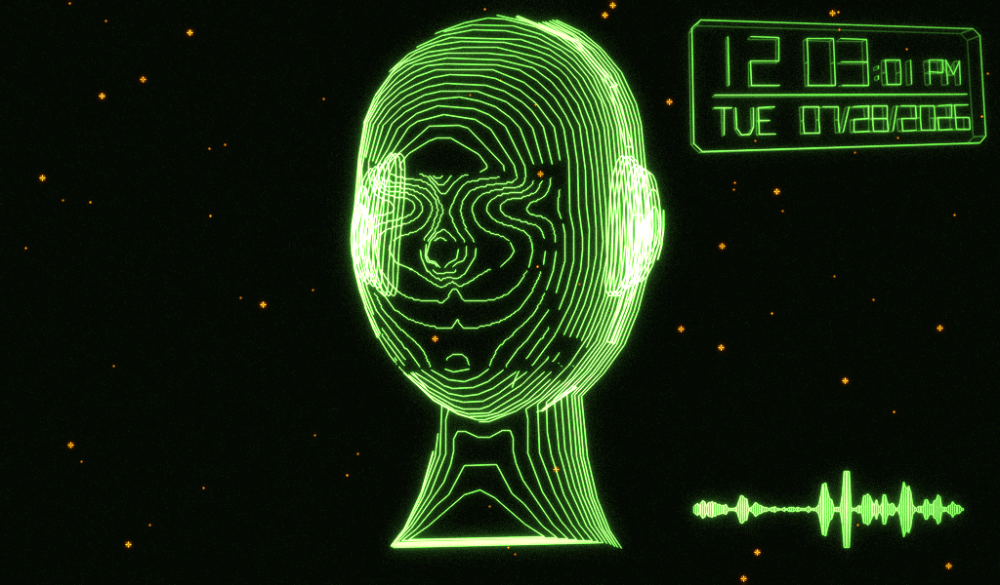

<h1 align="center">TEK</h1>
<p align="center"><b>Terminal . Entity . Keeper</b></p>

<p align="center">
  
</p>

<p align="center">
  
  
</p>

<p align="center"><sub>Top: the panel in the room. Bottom: frames read straight out of <code>/dev/fb0</code> on a running box — idle, and mid-sentence.</sub></p>

---

## Give a language model a face, a voice, and a pair of eyes

TEK is a **body for a model you already pay for**. It is not another assistant
and it does not ship a model of its own. It takes Claude — or anything else you
can invoke from a command line — and gives it:

* **A mouth.** Local neural speech, on-device, no cloud TTS bill.
* **Ears.** Local wake word and transcription. Nothing is sent anywhere until
  you say the wake word.
* **Eyes.** A camera that detects faces, recognises the people you enrol, and
  can hand the model a still frame to look at.
* **A presence.** A rendered head that tracks you, blinks, and mouths every
  word in sync — on a cheap panel, with no desktop, no browser and no X server.
* **Judgement about when to speak.** Every perception path can return *silence*,
  and usually does.

It runs headless on a **single-board computer** — a Jetson Nano, a Raspberry Pi,
or anything with a Linux framebuffer, a camera and a speaker — and it is built
to sit powered-on in a room for months.

```
 camera ──┐                                    ┌──> speaker (Bluetooth or wired)
          ├──> event ──> gates ──> model ──────┤
 mic ─────┘              (debounce,   (your    └──> the face mouths it, in sync
                          cooldown,    CLI)
                          silence)
```

**The design split that makes this cheap to run:** the board is the *senses and
the always-on body*; the brain is an API call. No GPU inference, no 7B model
quantised into 2 GB of RAM, no fine-tuning. A Nano cannot run a good model and
should not try — but it can listen, watch, recognise and speak all day for the
price of the electricity.

---

## Who this is for

| You want | TEK gives you |
|---|---|
| A voice assistant that is actually *yours* | Wake word, local STT/TTS, your own prompt, your own model choice |
| Something on a Pi/Jetson that is not a blinking LED | A rendered face at ~29 fps on a $30 panel |
| A model that can **see** | Camera frames handed to a vision model on a trigger you control |
| To know who is home | Local face recognition with enrolment, plus a seen-log |
| A base for a robot | A persona, a mouth, ears, eyes and an event bus — bolt on servos |
| To stop paying for cloud speech | Piper + Vosk, both on-device |

**Good fits:** a hallway or kitchen presence; a workshop assistant you talk to
with your hands full; a reception desk that greets known staff; a lab or server
room that answers questions about what it can see; the head and voice of a
robot.

---

## What comes in the box

Everything below is implemented and running today — not planned.

### Speech out
* **Piper neural TTS**, on-device. 38 English voices auditioned on real hardware
  ([§3.4](#34-every-english-piper-voice)), plus pico/flite/espeak as fallbacks.
* Synthesis at **0.72× real-time** — it generates faster than it speaks, so long
  replies stream without gaps.
* **Lip-sync is structural, not approximate.** The audio going to the speaker
  and the audio driving the mouth are *one signal with two consumers*
  ([§4.1](#41-the-dry-spine)). Measured: 5.92 s of mouth for 5.92 s of audio.

### Speech in
* **Vosk** wake word + transcription, fully local. Wake spotting costs **0.11×
  real-time** — about 11% of one core, always on.
* Wake phrases ship with near-miss variants (`hey tek`, `hey tech`, `hey tec`,
  `hey tex`, `hey deck`, `ok tek`, `okay tech`, …) because a recogniser mishears
  a short word constantly.
* **It cannot transcribe your household.** The wake grammar runs on everything
  but can only emit its wake phrases or `[unk]` — full decoding is switched on
  only *after* the wake word matches.
* **It cannot hear itself.** A gate feeds silence to the segmenter while the
  face is speaking, plus a 1.2 s tail for Bluetooth latency and reverb.
  Verified: saying "Hey Tek" through the speaker produced **0 false wakes**.

### Vision and recognition
* Haar/LBP face detection driving head gaze, with critically-damped follow.
* **LBPH face recognition, local, no network, no embeddings server.** Enrol
  someone from the camera in about a minute; the gallery is plain PNGs on disk.
* **Eye-aligned crops** — geometry, not lighting, is what breaks recognition.
  Measured: a 10 px shift costs 98.1 in LBPH distance as-cropped and **36.6**
  eye-aligned, against a threshold of 62.
* Recognition is **throttled to 2 Hz and voted over a 4-second window**, so one
  bad frame cannot wipe the label.
* A **registry** (`~/.config/tekdromo/people.json`) records who is enrolled,
  when, how many times they have been seen and when last.

```bash
tek face enrol JOSH      # ~10 samples from the live camera
tek face list            # NAME  SAMPLES  ENROLLED  LAST SEEN  TIMES
tek face forget JOSH     # photographs and record both deleted
```

### The display
A Tektronix 4014 storage-tube emulation rendered straight to `/dev/fb0`. No X,
no browser, no compositor. The head is **not a mesh** — it is an implicit height
field sliced into iso-contours ([§1](#1-what-it-is)), which is why the lines flow
around every feature instead of reading as decals. On-screen: the head, a clock
panel, a live audio scope, and a recognition panel naming whoever is in front of
the camera.

### The parts that stop it being a demo
* **A panic key.** Three ESC presses kill the display and hand back the console
  in 0.7 s ([§0](#0-getting-out--the-panic-key)) — because a full-screen
  framebuffer app with no VT can genuinely lock you out of your own machine.
* **Restraint by construction.** Debounce, cooldown, departures ignored, and
  `SILENCE` as a first-class model response ([§9](#9-the-camera-can-prompt-me)).
  A face that comments on every arrival is unbearable within a day.
* **A test suite that uses the real hardware** — including one that plays the
  wake word out of the speaker so the mic picks it out of the room, and one that
  reads `/dev/fb0` while actually speaking to verify lip-sync
  ([§6](#6-testing)).

---

## Requirements

| | |
|---|---|
| **Board** | Jetson Nano 2GB (the reference build) · Raspberry Pi 4/5 or any Linux SBC with `/dev/fb0` |
| **Display** | Anything the framebuffer drives. The reference panel is 1024×600. |
| **Camera** | Any UVC webcam. MJPG at 640×480 — YUYV saturates USB 2.0. |
| **Audio** | Any PulseAudio sink. Bluetooth A2DP works; wired is easier. |
| **Mic** | Any PulseAudio source (the reference build uses the webcam's). |
| **Python** | 3.6+ (this box is pinned at 3.6.9, so the code avoids anything newer) |
| **Packages** | `numpy`, `opencv` **with contrib** (`cv2.face` is required), `onnxruntime`, `vosk`, `webrtcvad` |
| **Binaries** | `espeak-ng`, PulseAudio (`pactl`/`parec`/`pacat`), and a model CLI |
| **Model** | [Claude Code](https://claude.com/claude-code) CLI by default — swap it for any command that takes a prompt and prints a reply |
| **RAM** | 665 MB in steady state, all three services running |

> **Portability, stated honestly.** This is developed and measured on a Jetson
> Nano. Nothing in the design is Tegra-specific — it is a framebuffer, V4L2,
> PulseAudio and CPU numpy/OpenCV — so a Raspberry Pi should be a
> straightforward port, and a Pi 4 has more CPU headroom than the Nano does.
> But **it has not yet been run on a Pi**, and the Jetson workarounds in
> [§5](#5-hardware-notes-and-traps) (`OPENBLAS_CORETYPE`, the side-loaded
> libstdc++, the A2DP plugin fix) are Nano-specific and can simply be skipped.
> If you get it up on a Pi, a PR fixing this paragraph is the single most useful
> contribution available.

---

## Install

```bash
git clone <your-fork-url> ~/tekdromo && cd ~/tekdromo
ln -sf "$PWD/tek" ~/.local/bin/tek        # tek sets its own environment

# large binaries, deliberately not in git:
tools/fetch_voice.sh --list               # every English Piper voice
tools/fetch_voice.sh en_US-kusal-medium   # ~61MB, the speaking voice

curl -sSL -o m.zip https://alphacephei.com/vosk/models/vosk-model-small-en-us-0.15.zip
unzip -q m.zip -d models/ && rm m.zip     # ~68MB, speech recognition

# ~54MB, 68-point landmarks. DO NOT SKIP THIS ONE: without it the HUD face
# panel and the eye alignment that recognition depends on both switch
# themselves off silently, with no error anywhere.
curl -sSL -o models/lbfmodel.yaml \
  https://raw.githubusercontent.com/kurnianggoro/GSOC2017/master/data/lbfmodel.yaml

# the four services
sudo cp services/*.service /etc/systemd/system/
sudo systemctl daemon-reload
sudo systemctl enable --now tek-panic tek-display tek-voice
```

> **Two things to change for your machine.**
>
> The unit files hardcode `/home/super`, `User=super` and
> `XDG_RUNTIME_DIR=/run/user/1000`:
> `sed -i "s|/home/super|$HOME|g; s|User=super|User=$USER|; s|/run/user/1000|/run/user/$(id -u)|g" services/*.service`
>
> And `tools/bt_keepalive.sh` defaults to the reference build's Bluetooth
> speaker. Set `TEK_BT_MAC` to yours — or skip `tek-bluetooth` entirely if you
> are on wired audio, since nothing else depends on it.

Then:

```bash
tek say "hello"          # speak; the face mouths it (read §3.6 first)
tek status               # which voice, is it speaking
tek ears                 # what it is listening to, and what it has heard
tek watch                # camera triggering: on/off, cooldown, event count
tek look                 # look right now and decide whether to speak
tek face list            # who it recognises
tek panic                # stop the display, hand back the console
```

Describe your household in `~/.config/tekdromo/people.md`, in plain English —
that text is handed to the model with the camera frame
([§9](#9-the-camera-can-prompt-me)).

---

## Contents

0. [**Getting out — the panic key**](#0-getting-out--the-panic-key) ← if you are staring at a face you cannot dismiss
1. [What it is](#1-what-it-is)
2. [Quick start](#2-quick-start)
3. [The voice](#3-the-voice) — [all 38 Piper voices](#34-every-english-piper-voice) · [**how to speak (read this first)**](#36-speaking-from-a-shell--the-mouth-harness)
3b. [**Listening** — the ear](#3b-listening--the-ear)
4. [Architecture](#4-architecture)
5. [Hardware notes and traps](#5-hardware-notes-and-traps)
6. [Testing](#6-testing)
7. [Services](#7-services)
8. [Measured results](#8-measured-results)
9. [The camera can prompt me](#9-the-camera-can-prompt-me)
10. [Extending TEK — sensors, Home Assistant, robotics](#10-extending-tek--sensors-home-assistant-robotics)
11. [Privacy, consent and what this is not](#11-privacy-consent-and-what-this-is-not)
12. [Collaborating](#12-collaborating)
13. [Roadmap](#13-roadmap)

<sub>Built on: 4× Cortex-A57 @1.48GHz, 2GB RAM, Python 3.6.9, glibc 2.27. Those
constraints shaped nearly every decision here, and where something looks odd it
is usually because the obvious approach does not exist on this box.</sub>

---

## 0. Getting out — the panic key

### Press ESC three times.

The display stops and the text console comes back, in about **0.7 s**. Five
presses instead of three stops the voice as well.

```
ESC ESC ESC        console back
ESC ESC ESC ESC ESC   console back, and silence

sudo systemctl start tek-display     # bring the face back
```

From a shell — local or over SSH — the same thing is `tek panic`
(or `tek panic quiet`).

### Why this needs to exist

This was found the hard way. The machine rebooted and became genuinely
unusable:

* The display writes straight to `/dev/fb0`, over the top of the text console.
  It does not own a VT, so **`Ctrl+Alt+F2` does not help** — switching consoles
  repaints the screen and the display simply paints over it again 33 ms later.
* `Display.close` deliberately leaves the last frame on the panel, because it
  makes service restarts invisible ([§8](#8-measured-results)). So even
  stopping the display leaves the face sitting there.
* The wifi was configured as a **user** connection, so it did not come up until
  somebody logged in — and nobody could see the login prompt to log in.

The only way back in was to blind-type a username and password roughly a
hundred times until they happened to land in the right fields.

### What was changed

| | Before | After |
|---|---|---|
| Wifi profiles | `permissions=user:super:;` — needs a login session | system-scoped, connects at boot |
| Wifi secret | (already `psk-flags=0`, fine) | unchanged, verified |
| Escape hatch | none | `tek-panic.service`, ESC ×3 |
| tty1 | login prompt, typed blind | `agetty --autologin super` |

`tty1` autologin means a shell is already waiting the moment the console comes
back, instead of a login prompt you cannot see. It is a physical-access-only
box on a home LAN; **SSH still requires a password**.

The NetworkManager change is the important half: **SSH now works before anyone
logs in**, which is the real fix. The panic key is the fallback for when the
network is also gone.

### How the panic key is built

`tekdromo/panic.py`, run as root by `tek-panic.service`. Every choice in it is
about the failure case rather than the happy path:

* **It is a separate process.** A panic key inside the thing you are escaping
  from is not a panic key — the case you need it for is the one where that
  process is wedged.
* **It imports nothing from this project, not even numpy.** The escape hatch
  must not be able to fail for the same reason the thing it rescues failed.
* **It rescans `/dev/input` every 2 s.** The keyboard gets plugged in *after*
  things go wrong, so enumerating once at startup would miss the only keyboard
  that ever matters. It watches every device rather than guessing which are
  keyboards — nothing but a keyboard sends `KEY_ESC`, and this box already has
  a webcam that registers as one.
* **Autorepeat does not count** (`value == 2`), so leaning on the key does
  nothing.
* **The window is measured on the monotonic clock**, because this box sets its
  clock from the network a minute into boot and a wall-clock jump mid-chord
  would otherwise fire it by itself.
* **It forces the console to repaint** by switching VT away and back. Stopping
  the display is only half the job.

Measured on the live system: stop 0.22 s, repaint 0.44 s, and the panel goes
from 127,576 lit pixels to 25,267 — the face gone, a console in its place.
`tests/panic_unit.py` proves the chord logic and drives a **real virtual
keyboard through the kernel input stack**, created *after* the watcher starts,
because that ordering is the entire point. `tools/panic_e2e.py` fires it at the
live service.

### Still stuck?

`Alt+SysRq` is fully enabled (`kernel.sysrq = 1`). `Alt+SysRq+R E I S U B` is
the last resort — it will reboot the box without corrupting the filesystem.

---

## 1. What it is

<sub>**On the two names:** **TEK** — *Terminal. Entity. Keeper.* — is the
persona: the face, the voice, the thing you talk to. **tekdromo** is the
codebase, the Python package and the systemd unit prefix. They are the same
project.</sub>

Four services that together make a face which can hold a conversation.

| Service | Job |
|---|---|
| `tek-display` | Renders the head to `/dev/fb0` at ~30 fps. Never stops. |
| `tek-voice` | Speech in and out. Owns the voice, the speaker, the mouth stream, the ear, and the event gates. |
| `tek-bluetooth` | Keeps the Bluetooth speaker connected and audio routed to it. |
| `tek-panic` | Root, independent of the rest. ESC ×3 hands back the console. |

The aesthetic is a genuine constraint, not decoration. A Direct-View Storage
Tube walks an electron beam point-to-point and the phosphor holds the charge,
so: **no fills, no shading, no scanlines** (it does not scan — adding them is
the classic fake tell), constant beam intensity, and an all-or-nothing erase
flash.

The head is not a mesh. It is an **implicit height field sliced into
iso-contours**, which is the central idea of the whole project:

```
z(x,y) = skull + forehead + brow + nose + cheeks + lips + chin
         − eyes − philtrum − nostrils
for z = .95 down to −.25 step −.05:   extract contours → emit vectors
```

Because contours are level sets of the real surface, **they flow around every
feature for free**. An earlier attempt drew feature curves onto an undeformed
mesh and every one of them read as a decal.

<sub>[↑ Contents](#contents)</sub>

---

## 2. Command reference

`tek` sets its own environment — `OPENBLAS_CORETYPE`, `XDG_RUNTIME_DIR`,
`LD_LIBRARY_PATH` — so it works identically from a login shell, a cron job or a
systemd unit. Installation is in [Install](#install), above.

**Speaking**

| | |
|---|---|
| `tek say "…"` | Speak it; the face mouths it. **[Read §3.6 first](#36-speaking-from-a-shell--the-mouth-harness)** |
| `tek say --no-wait "…"` | Return immediately instead of waiting for the end |
| `tek say --voice NAME "…"` | Use another voice once, without changing the default |
| `tek voice en_US-kusal-medium` | Set the default voice, permanently |
| `tek voices` | Which engines actually work on this machine |
| `tek audition --piper` | Hear every Piper model say the same line, out loud |
| `tek audition --voices a,b,c` | Audition exactly these |
| `tek listen` | Print mouth frames live — proves the display feed |
| `tek status` | Which voice, is it speaking, how many utterances |

**Listening**

| | |
|---|---|
| `tek ears` | State: device, wake words, counts, and near-misses with peak levels |
| `tek ears on` / `off` | The microphone is *closed*, not merely ignored |

**Watching**

| | |
|---|---|
| `tek watch` | Is it on, the cooldown, the brain, events seen and acted on |
| `tek watch off` | Stop acting on camera events |
| `tek watch --cooldown 600` | Be less talkative |
| `tek look` | Look right now and decide (manual trigger) |
| `tek look --force` | Ignore the cooldown |

**Recognition**

| | |
|---|---|
| `tek face list` | Name, samples, enrolled date, last seen, times seen |
| `tek face enrol NAME` | Take samples from the live camera (`--samples N`) |
| `tek face forget NAME` | Delete the photographs and the record together |

**Keeping the speaker awake** — see [§7](#keeping-the-bluetooth-speaker-awake)

| | |
|---|---|
| `tek keepalive` | Interval, tone, how many sent, idle time |
| `tek keepalive --every 300` | Less often · `--every 0` disables |
| `tek keepalive --hz 200 --amp 0.02 --secs 0.25` | Tune for your speaker |

**Getting out**

| | |
|---|---|
| `tek panic` | Stop the display, force the console to repaint |
| `tek panic quiet` | …and stop the voice as well |

<sub>[↑ Contents](#contents)</sub>

---

## 3. The voice

### 3.1 Chosen voice

**`en_US-kusal-medium`** — picked by ear, out loud, through the actual Bluetooth
speaker in the actual room. Judging a voice from a waveform or on headphones is
a different test.

Change it any time; nothing is baked in:

```bash
tek voice en_GB-alba-medium
```

The choice is stored in `~/.config/tekdromo/voice.json` — outside the repo,
because it is a per-machine preference rather than code. The same checkout on a
box with different speakers may want a different voice.

### 3.2 Shortlist

Three finalists came out of listening to 20 voices:

| Voice | | Why |
|---|---|---|
| `en_US-kusal-medium` | **chosen** | US English |
| `en_GB-alba-medium` | shortlisted | Scottish — the most distinctive of the three |
| `en_US-amy-medium` | shortlisted | US English, warmer and softer than lessac |

### 3.3 There are far more than 38

The catalogue lists **38 English voices**, but that undersells it. Seven of them
are *multi-speaker* models containing **1,975 more voices** — `en_US-libritts`
alone holds 904 speakers, `en_GB-vctk` holds 109.

Of the 38, only a handful are genuinely distinct speakers not yet heard:
`danny`, `kathleen`, `reza_ibrahim`. Eight more are simply `low`/`high` quality
variants of voices already sampled.

> **On `high` quality:** medium models synthesise at **0.72× real-time** here.
> High-quality models are larger networks and will land near or above 1.0×,
> which means a pause before speech starts. On this board, medium is the right
> trade.

> **Multi-speaker models are not wired up yet.** They need an extra
> `speaker_id` input that `PiperVoice` does not pass. Small change, not done.

### 3.4 Every English Piper voice

"Sampled" means it was played aloud through the speaker during voice selection.

#### en_US

| Voice | Quality | Speakers | Sampled | Note |
|---|---|---|---|---|
| `en_US-amy-low` | low | 1 | — |  |
| `en_US-amy-medium` | medium | 1 | yes | shortlisted |
| `en_US-arctic-medium` | medium | 18 | — |  |
| `en_US-bryce-medium` | medium | 1 | yes |  |
| `en_US-danny-low` | low | 1 | — |  |
| `en_US-hfc_female-medium` | medium | 1 | yes |  |
| `en_US-hfc_male-medium` | medium | 1 | yes |  |
| `en_US-joe-medium` | medium | 1 | yes |  |
| `en_US-john-medium` | medium | 1 | yes |  |
| `en_US-kathleen-low` | low | 1 | — |  |
| `en_US-kristin-medium` | medium | 1 | yes |  |
| `en_US-kusal-medium` | medium | 1 | yes | **CHOSEN** |
| `en_US-l2arctic-medium` | medium | 24 | — |  |
| `en_US-lessac-high` | high | 1 | — |  |
| `en_US-lessac-low` | low | 1 | — |  |
| `en_US-lessac-medium` | medium | 1 | yes |  |
| `en_US-libritts-high` | high | 904 | — |  |
| `en_US-libritts_r-medium` | medium | 904 | — |  |
| `en_US-ljspeech-high` | high | 1 | — |  |
| `en_US-ljspeech-medium` | medium | 1 | yes |  |
| `en_US-mike-medium` | medium | 1 | yes |  |
| `en_US-norman-medium` | medium | 1 | yes |  |
| `en_US-reza_ibrahim-medium` | medium | 1 | — |  |
| `en_US-ryan-high` | high | 1 | — |  |
| `en_US-ryan-low` | low | 1 | — |  |
| `en_US-ryan-medium` | medium | 1 | yes |  |
| `en_US-sam-medium` | medium | 1 | yes |  |

#### en_GB

| Voice | Quality | Speakers | Sampled | Note |
|---|---|---|---|---|
| `en_GB-alan-low` | low | 1 | — |  |
| `en_GB-alan-medium` | medium | 1 | yes |  |
| `en_GB-alba-medium` | medium | 1 | yes | shortlisted |
| `en_GB-aru-medium` | medium | 12 | — |  |
| `en_GB-cori-high` | high | 1 | — |  |
| `en_GB-cori-medium` | medium | 1 | yes |  |
| `en_GB-jenny_dioco-medium` | medium | 1 | yes |  |
| `en_GB-northern_english_male-medium` | medium | 1 | yes |  |
| `en_GB-semaine-medium` | medium | 4 | — |  |
| `en_GB-southern_english_female-low` | low | 1 | yes |  |
| `en_GB-vctk-medium` | medium | 109 | — |  |

Fetch any of them:

```bash
tools/fetch_voice.sh en_US-ryan-high en_GB-cori-medium
```

### 3.5 Fallback voices

Piper is what ships, but three native synths are kept behind the same `Voice`
interface — `pico` (SVOX Pico), `flite`, `espeak`. A household assistant that
cannot talk is useless, so if a model file is missing or onnxruntime fails to
load, speaking badly beats not speaking.

`espeak` is never an extra dependency: **it is Piper's phonemiser.**

### 3.6 Speaking from a shell — the mouth harness

> **If you are an assistant driving this machine, read this section before
> using the voice.** Two mistakes were made here the hard way and both are
> avoidable.

```bash
tek say "the entire reply, in one call"
```

That is all it takes. No file, no temp buffer, no setup. The text goes from the
command straight to the speaker, and the face mouths it from the same PCM.

#### Rule 1 — pass the whole reply in ONE call

**Do not split a reply across several `tek say` calls.** It is the obvious thing
to do and it sounds broken.

Each call opens a speaker, plays, closes it, and returns. So every boundary
becomes a silence as long as the *next* part takes to synthesise — roughly 0.7×
its spoken length. A listener describes the result as *"too many breaks, it is
not fluid"*, and they are right.

Inside a single call the service already streams properly: it splits the text
into ramped chunks, synthesises **ahead of** playback, and writes everything to
one continuous sink. Measured on a 73-second reply:

| | one call | split across 8 calls |
|---|---|---|
| Gaps over 250 ms | **0** | one at every boundary |
| Median frame gap | 20 ms | 20 ms, with ~1.5 s holes |

#### Rule 2 — expect a beat before long replies, and none before short ones

| Reply length | Time to first word | Why |
|---|---|---|
| A sentence or two | effectively immediate | synthesis finishes before the head-start threshold is reached, so the wait is skipped |
| A paragraph or more | **~5.5 s** | builds `MIN_LEAD_S` of buffered audio first |

That head start is not padding. Synthesis runs at **0.71× real-time**, so each
second of playback buys only 0.4 s of lead — which means the risk of playback
overtaking synthesis is entirely at the *start*, before any lead exists. Without
it, a long reply breaks up three or four times in the first half and is smooth
thereafter.

The effect is that conversation paces itself about right: quick answers come
back instantly, a considered one takes a beat before it starts.

#### Shell quoting

Double quotes are fine, and so are apostrophes inside them:

```bash
tek say "I don't think that's the real problem."
```

Avoid `"`, `$`, backticks and `\` in the text — the shell will eat them. If the
wording needs any of those, write it to a file and pass it in:

```bash
tek say "$(tr '\n' ' ' < reply.txt)"
```

A file is **never** required for ordinary sentences. Reaching for one by default
is just caution about quoting, not a limitation of the harness.

#### Other flags

```bash
tek say --no-wait "working on it"        # return immediately; narrate progress
tek say --voice pico "compare this"      # one-off voice, default unchanged
tek listen                               # watch the mouth stream live
```

`--no-wait` is the right choice when narrating long-running work, so the shell
carries on while the sentence plays.

#### Writing for the ear

Text that reads well is not the same as text that *hears* well. Shorter
sentences, less subordinate-clause nesting, and real punctuation — the model was
trained **with** punctuation phonemes, so commas and full stops are literally
its pause cues. A paragraph with no punctuation comes out as a breathless
monotone.

<sub>[↑ Contents](#contents)</sub>

---

## 3b. Listening — the ear

```bash
tek ears            # state: what it is listening to, and what it has heard
tek ears off        # stop listening (the microphone is closed, not ignored)
```

Say **"hey tek"** and then a question — in one breath, or as two. It answers out
loud.

```
mic → Gate → VAD → wake grammar → free decode → brain → speech
```

Proven end to end through real air, nothing stubbed
(`tools/ears_e2e.py` plays the wake word through the speaker so the mic picks it
out of the room exactly as it would pick up a person):

```
ears: woken (1.7s) - waiting 8s for a command
ears: heard 'what day of the week is it' (3.9s)
event speech: saying "It's Monday."
```

Four things it must not do, each of which shaped the design:

**It must not hear itself.** The mic picks the speaker up at ~11× ambient and
Vosk transcribes Piper *perfectly* — the loopback test reads back 12 of 12
keywords. Unchecked, it answers its own replies forever. `Gate` feeds silence to
the segmenter while the face is speaking, plus a 1.2 s tail for A2DP latency and
reverb. Verified by saying "Hey Tek" out loud three times: **0 wakes**.

**It must not transcribe the household.** The wake grammar runs on everything,
but it can only emit its four phrases or `[unk]` — it cannot produce a
transcript. Full decoding happens only after the wake word matches. Local only,
wake-word gated, nothing leaves the house.

**It must not trust "the default microphone".** The mic is inside the webcam, so
a camera replug moves the PulseAudio default to the Tegra onboard input — which
has nothing plugged into it — and it never moves back. That was observed live:
two recorders sitting on a dead device while the real mic was idle, with the ear
reporting itself perfectly healthy and hearing nothing. `io.working_source()`
probes candidates for a *varying* signal, because a dead input is not silent,
it is constant.

**It must not go quietly deaf.** Neither "wrong device" nor "no frames" ends the
stream, so a reader just sits blocked forever. A watchdog closes the source to
break it loose and the reader re-probes.

### The model, and why answers were thin

Answers used to be one flat line because **the prompt asked for that** — "one
or two short sentences", and then `parse()` cut whatever survived at 400
characters. No model was going to fix that. Length is now per event: a camera
greeting is still a sentence or two, an answer is not.

The model was `haiku`, chosen "because latency matters more than depth". That
was never measured. Same prompts, same box, three questions each:

| model | mean |
|---|---|
| `haiku` | **10.5 s** — the *slowest* |
| `sonnet` | 7.7 s |
| `opus` | **7.5 s** — fastest *and* best |

Latency here is dominated by CLI startup and session setup, not by the model,
so the "fast" choice cost quality and bought nothing. Default is now `opus`.

Replies are **spoken as they are written** (`--include-partial-messages`), so
time-to-first-word no longer grows with the length of the answer — which is
what makes depth affordable. Measured live: a 624-character answer began
speaking at 12.7 s and ran 35 s without a gap (15 chunks, producer at 0.92×).

`tools/brain_bench.py` reproduces the model comparison.

A spoken question **skips the camera cooldown**. That cooldown exists to stop
the camera remarking on an ordinary evening; applying it to someone who spoke
directly to you reads as broken, not as restraint.

<sub>[↑ Contents](#contents)</sub>

---

## 4. Architecture

### 4.1 The DRY spine

Every stage of a voice loop either consumes audio or produces it. So there is
**one** PCM contract — 16 kHz, mono, `int16`, 20 ms frames — and **one** pair of
abstractions:

```
Source  yields frames        Sink  accepts frames
```

Everything else is expressed in those terms, which buys three things that are
not merely tidy:

* **A microphone and a WAV file are the same type**, so the entire pipeline was
  built and tested before any microphone existed.
* **The mouth is a Sink.** The audio going to the speaker and the audio driving
  the face are not two signals kept in agreement — they are *one signal with two
  consumers*. Lip-sync is a property of the topology.
* **Wake word and transcription are one model with two grammars**, not two
  engines.

`pcm.RATE` is 16 kHz because that is native for Vosk *and* Whisper, so the
recognition path needs no conversion at all. 20 ms because WebRTC's VAD accepts
only 10/20/30 ms frames. Resampling happens **only** at hardware edges.

### 4.2 Module map

```
tekdromo/
  app.py          display application, frame loop, startup
  anatomy.py      measured shape + FDL constants + blob/ridge primitives
  field.py        the surface equation, neck unioned with max()
  contour.py      marching squares, ears, back shell
  rig.py          expression rig: controls -> regions -> cached contours
  geometry.py     rotate, project, back-face cull
  phosphor.py     bloom, phosphor LUT, the storage-tube look
  starfield.py    amber backdrop, same renderer
  camera.py       face tracking (background thread) + critically-damped follow
  voice_link.py   display end of the voice seam (~30 lines)
  voice/
    pcm.py        THE audio contract + resample/envelope
    io.py         Source/Sink; Mic/Wav/Tone, Speaker/Wav/Null/Tee/Delay
    vad.py        WebRTC VAD segmenter with pre-roll and hang-over
    stt.py        Vosk recognition; wake grammar + free decode
    tts.py        Voice interface; Piper/Pico/Flite/Espeak
    phonemes.py   espeak-ng -> IPA -> phoneme IDs (replaces piper-phonemize)
    bus.py        line-JSON over a Unix socket, shared by both processes
    service.py    the wiring; tek-voice entry point
    cli.py        the `tek` command
```

### 4.3 The expression rig

```
EXPRESSIONS  named presets → control values
     ↓
CONTROLS     10 named scalars — the ONLY animation state
     ↓
REGIONS      a bbox + a field function + which controls touch it
     ↓
CACHE        re-contour ONE region, memoised on quantised controls
```

The face is a field, so an expression is just different numbers in the
equation — no blendshapes, no skinning. A full rebuild is ~4 s, but an
expression only disturbs a small box, and the field outside that box is
unchanged so contours still meet the border exactly. Warm cost: **0.27 ms per
frame**.

Adding an expression is one line. Adding a control is one line plus a term in a
field function. Blink is *not* an expression — it is a reflex on its own timer
that clamps `eye_open`, so it works during any expression and during speech.

<p align="center">
  
</p>

<p align="center"><sub>Caught mid-blink <i>while speaking</i> — eyes shut, mouth
open, scope live. The blink reflex clamps <code>eye_open</code> underneath
whatever else is driving the face, so it never has to be scheduled around
speech.</sub></p>

### 4.4 Piper without piper-phonemize

The official Piper wrapper needs Python 3.9+; this box has 3.6.9.
`piper-phonemize` has no 3.6 build at all and is the real blocker — but it is
only a C++ shim over espeak-ng, **which is already in apt**. So:

```
text → espeak-ng --ipa → the model's own phoneme_id_map → onnxruntime → PCM
```

and the dependency disappears. Two risks were predicted and both evaporated on
measurement:

| Predicted | Actual |
|---|---|
| espeak-ng 1.49.2 (2018) too old; build 1.52 from source | **100% phoneme coverage**, 0 unmapped. No build needed. |
| ORT 1.10 (last cp36 aarch64 wheel) won't load a 2023 VITS export | Loads clean |

espeak's `--ipa` **drops punctuation** and emits a newline instead, but the
model was *trained with* punctuation phonemes — they are its pause cues. Clauses
are phonemised separately and the punctuation put back, which is what gives it
sentence rhythm rather than a flat monotone.

A side benefit: `speech.from_envelope()` hardcodes `rounding=0` and explains
why — *"real viseme shape needs phoneme information, which an envelope does not
carry."* The Piper path **has** the phonemes, so the mouth rounds on /u/, /o/,
/w/.

<sub>[↑ Contents](#contents)</sub>

---

## 5. Hardware notes and traps

Read these before debugging anything.

1. **`OPENBLAS_CORETYPE=ARMV8` is mandatory.** Without it `import numpy` and
   `import cv2` die with **SIGILL** — numpy 1.19.5's OpenBLAS misdetects the
   A57. Set it in every new service and cron job.
2. **systemd is 237.** `StandardOutput=append:` is silently ignored.
   `StartLimitIntervalSec`/`StartLimitBurst` must be in **`[Unit]`**; in
   `[Service]` they are silently ignored.
3. **systemd drop-ins are applied in lexicographic *filename* order across all
   directories.** `/etc` does **not** automatically beat `/lib`. An override
   named `10-foo.conf` loses to `nv-bar.conf`; it must sort *after*.
4. **JetPack disables A2DP.** NVIDIA ships a drop-in starting `bluetoothd` with
   `--noplugin=audio,a2dp,avrcp`. A speaker can pair but can never carry audio.
5. **The D-Bus policy denies uid 1000 access to `org.bluez`**, so PulseAudio
   cannot register a media endpoint. It surfaces as `Protocol not available`
   from BlueZ and `No default controller available` from `bluetoothctl` —
   neither of which points at permissions. Group membership cannot fix an
   already-running PulseAudio, so the policy names the user.
6. **`vosk`'s `libvosk.so` needs GCC 11+ libstdc++**; this box has GCC 7.5
   (`GLIBCXX_3.4.25`) and only 0.3.44/0.3.45 ship aarch64 wheels, both of which
   fail. A newer libstdc++ built *for* bionic lives in `lib/` and is used by
   `tek-voice` **only**, via `LD_LIBRARY_PATH`. The system runtime is
   deliberately untouched — replacing it globally risks the CUDA/OpenCV stack.
7. **`pacat`'s stdin has no backpressure.** It accepted **3.0 s of audio in
   0.01 s**. Nothing may use write progress as an audio clock.
8. **No desktop.** X/lightdm disabled, default target `multi-user`.
   `tek-display` owns `/dev/fb0` continuously. `sudo systemctl stop tek-display`
   to get the console back.
9. **L4T is pinned at 32.5.2.** 32.7.6 exists and is the last release for t210,
   deliberately not taken — it rewrites the bootloader and there is no backup of
   the card.

<sub>[↑ Contents](#contents)</sub>

---

## 6. Testing

```bash
for t in tests/*.py; do python3 "$t"; done
```

| Test | Covers | Hardware needed |
|---|---|---|
| `smoke.py` | end-to-end frame render | none |
| `holecheck.py` | every expression + blends leave no holes | none |
| `follow_unit.py` | camera follow, including integrator windup | none |
| `boot_camera.py` | camera attaches when it appears, not only if present | none |
| `voice_pcm.py` | framing, resampling, envelope, phoneme coverage | none |
| `voice_loopback.py` | the whole Source/Sink pipeline on stubs | none |
| `voice_bus.py` | protocol framing, dead subscribers, slow clients | none |
| `voice_stt.py` | recognition + VAD, using **Piper as the test signal** | none |
| `voice_watch.py` | the camera-prompt decision gate, on a stub brain | none |
| `hud_unit.py` | clock, scope and face panels | none |
| `panic_unit.py` | the escape hatch, incl. a **real uinput keyboard** | root for the last part |
| `voice_ears.py` | the self-hearing gate, wake/command logic, misheard wake words | none |
| `voice_lipsync.py` | reads `/dev/fb0` while really speaking | display + voice |

Three are disruptive and therefore live in `tools/`, not `tests/`:

| Tool | What it proves that the suite cannot |
|---|---|
| `panic_e2e.py` | the *installed service* stops the display, not just that a callback fired |
| `panic_screen.py` | reads `/dev/fb0` before and after — the console really comes back |
| `camera_replug.py` | deauthorizes the camera on the USB bus: a **real** unplug |
| `mic_check.py` | the mic produces a *varying* signal, not just samples |
| `mic_room.py` | speaks and records the room — the acoustic path, through air |
| `ears_e2e.py` | says the wake word aloud and checks it answers |
| `scope_check.py` | reads the waveform panel out of `/dev/fb0` while sound plays |

`camera_replug.py --hold` is the important one. It holds the old `/dev/videoN`
open across the unplug so the kernel cannot reuse that minor number, which
forces the camera to re-enumerate at a different index — the exact case that
broke when the camera was swapped. All three put things back afterwards.

`voice_stt.py` is the one worth noting: with no microphone available, **Piper
speaks the test sentences and Vosk reads them back**. The loop closes on-box.
That proves wiring, rates, framing, segmentation and grammar — it does *not*
prove acoustic performance, because synthetic speech has no room noise, reverb
or distance.

<sub>[↑ Contents](#contents)</sub>

---

## 7. Services

```bash
systemctl status tek-display tek-voice tek-bluetooth tek-panic
tools/check_boot.sh          # verify boot survival WITHOUT rebooting
```

`tek-panic` is the odd one out: it runs as **root**, has
`DefaultDependencies=no`, and is deliberately *not* ordered after
`tek-display`. It exists to escape the display, so it must come up before it
and survive independently of it — see [§0](#0-getting-out--the-panic-key).

`tek-display` and `tek-voice` **must agree on `XDG_RUNTIME_DIR`** or each looks
for the socket in a different place and they silently never connect.

The display must never stop, and seven failure modes are handled explicitly —
startup gap, per-frame exceptions, systemd's start limit, the console blanker, a
wedged model, blanking on exit, and a camera that has not enumerated yet. See
`TEKDROMO.md` §5.

### The speaker disconnecting is usually PulseAudio, not Bluetooth

If the speaker drops and has to be woken by hand, check this before touching
anything in BlueZ:

```bash
pulseaudio --dump-conf | grep exit-idle
journalctl --since today | grep -oE 'pulseaudio\[[0-9]+\]' | sort -u | wc -l
```

PulseAudio's default `exit-idle-time` is **20 seconds**: with no client
connected it shuts down, and the next client autospawns a fresh daemon. Every
one of those restarts tears down the A2DP link. **96 distinct PulseAudio
processes were logged in a single day** while this was tracked down.

It had run an entire night without a single drop, which is what made it look
like a regression in something else. The reason is that the display holds one
permanent recorder on the sink monitor, so the daemon was never idle — a
fragile thing to rest a speaker connection on. Anything that briefly closes
every stream (restarting a service, probing a device) opens a 20-second window
in which the whole audio stack quietly dies.

`exit-idle-time = -1` in `/etc/pulse/daemon.conf` (backup kept alongside it).
Verified: the full test suite now runs start to finish without the daemon's PID
changing. `tools/check_boot.sh` check 10b guards it.

### Keeping the Bluetooth speaker awake

There is a way the audio dies that is not on the Nano at all: **the speaker has
its own idle timer** and powers itself off when what it receives is digital
silence. Unloading `module-suspend-on-idle` keeps PulseAudio's *stream* open,
which is necessary but not sufficient — something has to actually be played.

```bash
tek keepalive                 # interval, tone, how many sent, idle time
tek keepalive --every 300     # less often
tek keepalive --every 0       # disable
tek keepalive --now           # send one immediately
```

After 120 s of genuine silence the voice service plays a **0.6 s tone at 40 Hz**,
faded in and out. Speech resets the timer and it is skipped while speaking, so a
talkative evening sends none at all.

All four parameters are tunable and persisted, because the right values depend
on the specific speaker and only listening settles them:

```bash
tek keepalive --hz 200 --amp 0.02 --secs 0.25 --every 90
```

**The first attempt did not work, and the reason is worth keeping.** It used
40 Hz, chosen *because* a portable driver cannot reproduce it — which is
self-defeating. A speaker's auto-off detector works on the same post-filter
signal path as its amplifier, so **a tone it cannot reproduce is a tone it
cannot detect**. "Inaudible because unreproducible" and "invisible to the
silence detector" are the same property. It sent 34 tones over three hours and
the speaker switched off anyway.

Ultrasonic is the other intuitive answer and is also wrong here, for a
different reason: children hear well past 18 kHz, so a tone the adults cannot
hear could quietly irritate the kids all day.

So the tone must sit **inside** the range the speaker really plays, and be kept
quiet and brief instead. It is still faded in and out — a waveform starting
mid-cycle is a step discontinuity, and a step contains every frequency, so even
an unobtrusive tone would announce itself with a click.

<sub>[↑ Contents](#contents)</sub>

---

## 8. Measured results

### Where the time and memory actually go

Profiled rather than guessed, with the house empty:

| | cost |
|---|---|
| `phosphor.render_bgra` | **21.75 ms** — 92% of the frame |
| `geometry.build_pts_culled` (1891 edges) | 1.22 ms |
| all four HUD panels together | 0.65 ms |
| `face.update` (the rig) | 0.10 ms |
| Haar detect / landmark fit / LBPH predict | 22.2 / 11.9 / 7.9 ms, at ≤6.7 Hz |

So the renderer *is* the display, and it is already at its floor — its
docstring records four optimisations that were measured and did not help,
including CUDA at 39.1 ms against 21.75 on the CPU. It is memory-bandwidth
bound at 1024×600, and OpenCV's NEON paths are the limit.

OpenCV threading was checked too: only Haar detect benefits (22.2 ms at four
threads against 37.8 at one), so cutting the pool would cost more than the
idle TBB workers do.

Steady state, whole system:

| | |
|---|---|
| `tek-display` | 100% of one core, 238 MB, 28.9 fps |
| `tek-voice` (idle, listening) | **~0% of a core**, 422 MB |
| `tek-panic` / `tek-bluetooth` | ~0%, 4 MB / 1 MB |
| load average | 2.6 of 4 cores · 65 °C |

The ear costs essentially nothing while nobody is talking, which is what the
VAD gate is for. Memory is the binding constraint, as predicted at the start:
665 MB of product against 1971 MB total.

Nothing in this table is an estimate.

| | |
|---|---|
| Render | 4.6 → **45 fps** across the optimisation pass |
| Steady state | **29.0–29.8 fps**, 0 errors, with voice running |
| Time to first frame | 9.47 s → **1.24 s** warm, 4.79 s cold |
| Face reconstruction | silhouette **0.996**, landmark error **3.8%** |
| Expression rig | **0.27 ms/frame** warm |
| Piper synthesis | **0.72× real-time** |
| Recognition (free) | **0.17× real-time** |
| Wake spotting | **0.11× real-time** — 11% of one core, always on |
| Word accuracy | **100%** on synthetic test phrases |
| Lip-sync | 5.92 s of mouth for 5.92 s of audio, paced at 20 ms |
| Bluetooth recovery | forced disconnect → reconnected in **~10 s** |
| Reclaimed | a full core, by disabling an idle-spinning BBS daemon |

Things that were measured and did **not** help, recorded so nobody repeats them:

| Idea | Result |
|---|---|
| CUDA bloom at 512×300 | 29 ms vs **6.8 ms** CPU pyramid — kernel launch dominates |
| numpy fancy-index instead of `cv2.LUT` | 25.1 ms vs **7.1 ms** — 3.5× worse |
| CUDA composite | 39.1 ms, 12.4 ms of it in upload/download alone |
| Box blur instead of gaussian | no change |

<sub>[↑ Contents](#contents)</sub>

---

## 9. The camera can prompt me

The camera does not just steer the head — it can **start a conversation**.

```
camera sees something  ->  debounce  ->  cooldown  ->  a model looks at the
                                                       frame and decides
                                                            |
                                    speaks  <---------------+---> stays silent
```

Silence is a first-class outcome, not a failure. A face that comments on every
arrival is unbearable within a day.

```bash
tek watch                 # is it on, what is the cooldown, how many events
tek watch off             # stop it acting on camera events
tek watch --cooldown 600  # be less talkative
tek look                  # look right now and decide (manual trigger)
tek look --force          # ignore the cooldown
```

### Why recognition broke on a new camera

It started saying UNKNOWN after the webcam was swapped. Leave-one-out on the
existing gallery, threshold 62:

```
median 47.4   p90 61.1   max 62.7   over threshold 1/12
```

That is the *same person* on the *same camera* already failing one sample in
twelve. It was living on the edge and nothing measured it.

`tools/face_diag.py` put those faces through what a different camera does:

| what changed | cost in LBPH distance |
|---|---|
| gamma, contrast | ~2–9 — nothing, the pipeline equalises |
| resolution loss | 54–59 |
| **an 8-pixel shift** | **78–84** |

Never lighting. **Geometry** — and the crop fed to LBPH was the raw Haar
rectangle, which jitters every frame and sits differently on a different lens.

Two fixes, both measured before being written:

* **Eye alignment.** The 68 landmarks already fitted for the HUD face panel
  make this free. A 10px shift goes 98.1 → 36.6; the real gallery's worst case
  goes 62.7 → 52.0, from *above* the threshold to comfortably below.
* **Training augmentation.** Lower-detail copies of each enrolled face, because
  the new camera is wider-angle and puts fewer pixels on a face. Third
  resolution + blur goes 61.0 → 41.4.

Recognition is also **throttled to 2 Hz and voted over a 4-second window**. A
single stray frame no longer wipes the label — which is what "it says unknown"
looks like from the sofa even when most frames are right.

`tools/face_realign.py` migrated the existing gallery, measuring before and
after and refusing to write if alignment had not helped.

**Still worth doing:** re-enrol on the new camera (`tek face enrol JOSH`).
Alignment and augmentation close most of the gap; samples actually taken
through this lens would close the rest.

### Who it thinks people are

Identity comes from **plain English**, not a face-recognition model. Describe
the household in `~/.config/tekdromo/people.md` and that text is handed to the
model along with the picture. No training step, no embeddings, no enrolment —
and someone undescribed is simply not greeted by name.

### Three gates before anything costs money

Every event that gets through is a model call, so:

| Gate | Where | Why |
|---|---|---|
| **Debounce** (2 s) | display | a detector glitch is not an arrival |
| **Cooldown** (180 s) | voice service | so `tek watch off` works without restarting the display |
| **Departures ignored** | voice service | announcing that someone left, to an empty room, is talking to nobody |

### Things that were wrong at first

* **`claude` is not on systemd's PATH.** It lives in `~/.local/bin`, so the
  subprocess never started. The brain caught the `OSError` and returned "no
  comment", which meant a **crash was indistinguishable from a thoughtful
  silence** — the log said `stayed quiet (0.0s)` and the `0.0` was the only
  clue. Failures are now logged loudly and the CLI path is absolute.
* **The brain ran in the project directory**, so it picked up `CLAUDE.md`,
  learned it had a voice, and started trying to run commands it had no
  permission for — turning a 10 s judgement call into 59 s of nothing. It now
  runs in a neutral directory with `--allowed-tools Read`.
* **`--allowed-tools` before the prompt** makes the CLI report the prompt as
  missing. Order matters.

Decision latency is **~10 s**. That is why the trigger fires on arrival rather
than waiting for someone to settle, and why `--brain-model` exists.

<sub>[↑ Contents](#contents)</sub>

---

## 10. Extending TEK — sensors, Home Assistant, robotics

### The extension point is one socket

Everything that makes TEK speak arrives as an **event** on a Unix socket at
`$XDG_RUNTIME_DIR/tekdromo-voice.sock`, as line-delimited JSON. The camera is
just the first producer; nothing in the pipeline knows or cares what generated
an event.

```bash
printf '%s\n' '{"cmd":"event","event":{
    "kind":"arrival",
    "faces":1,
    "what":"the garage door opened and nobody is enrolled as home",
    "image":"/tmp/porch.jpg"
}}' | nc -U "$XDG_RUNTIME_DIR/tekdromo-voice.sock"
```

| Field | Meaning |
|---|---|
| `kind` | `arrival` · `departure` · `manual` · `speech` — selects the model's *lean* (how eager it should be to speak) and the reply length cap |
| `what` | one plain-English sentence describing what happened; this is what the model reasons over |
| `faces` | how many faces were detected, if any |
| `image` | optional path to a still for the model to look at |

That is the whole contract. **Anything that can write a line of JSON can give
the face something to say** — and the same gates (cooldown, debounce, `SILENCE`)
apply automatically, so a new sensor cannot turn it into a device that will not
shut up.

### Sensors worth wiring in

None of these are implemented — they are the obvious next producers, and each is
a few lines against the socket above.

| Sensor | Event it produces | Why it is interesting |
|---|---|---|
| **BME280 / DHT22** (temp, humidity, pressure) | `"the workshop dropped below 4°C overnight"` | A falling barometer plus a forecast is a *remark*, not a readout |
| **PIR / mmWave presence** | `arrival` without needing the camera | Far cheaper than vision, works in the dark, no image leaves the room |
| **Thermal (MLX90640)** | `"something 38°C moved through the hallway"` | Presence and rough size with **no identifiable image at all** — the most privacy-preserving eye available |
| **IR-cut / night-vision camera** | the existing camera path, after dark | The Haar detector needs IR illumination to work at night |
| **Door/window reed contacts** | `"the back door opened"` | Pairs with recognition: an opening plus an unknown face is a different event from an opening plus a known one |
| **Air quality (SGP30, PMS5003)** | `"CO₂ has been over 1400ppm for two hours"` | The classic case for a thing that *speaks* rather than lights an LED |
| **Power / energy clamps** | `"the dryer has been running four hours"` | Anomalies are naturally spoken, not graphed |

The rule that keeps this pleasant: **give the model prose, not numbers.** `"CO₂
has been over 1400ppm for two hours in a room with someone in it"` produces a
useful remark. `{"co2": 1437}` produces a reading of a number back at you.

### Perimeter, driveway and street monitoring

> ⚠️ **Read [§11](#11-privacy-consent-and-what-this-is-not) before pointing a
> camera off your own property.** This use case carries real legal exposure and
> you take it on **at your own risk**. It is documented because people will
> build it either way, and doing it badly is worse than doing it knowingly.

Pointed at a driveway, a shopfront or a street, TEK becomes an **event narrator**
rather than a recorder: instead of hours of footage nobody watches, you get a
spoken or logged sentence when something happens.

**Use the vision-model path, not the face recogniser.** This is the part people
get wrong. The LBPH recogniser
([§9](#9-the-camera-can-prompt-me)) is the wrong tool outdoors and will actively
mislead you — it answers *"which of the three or four people I have been shown is
this?"*, it always returns its nearest match, and against unenrolled people it
produces confident wrong names. Turn it off for this. What works is the
`what` + `image` event path: a still frame goes to a vision model with a prompt,
and you get back a description.

```bash
# motion sensor / camera trigger fires -> narrate, do not identify
printf '%s\n' '{"cmd":"event","event":{
    "kind":"arrival",
    "what":"motion at the end of the driveway, 2am, no vehicle expected",
    "image":"/tmp/driveway.jpg"
}}' | nc -U "$XDG_RUNTIME_DIR/tekdromo-voice.sock"
```

**Categories that work, and stay defensible.** Ask the model about *activity and
objects*, which is what you actually care about and what it is reliable at:

| Useful | Why |
|---|---|
| delivery / courier vs. no package | the actual question at a front door |
| vehicle present, and roughly what kind | a van at 3am is the event, not a person |
| animal vs. person | kills most false alarms outright |
| approaching the door vs. passing by | intent is in the path, not the face |
| carrying something large, trying handles | behaviour is the signal worth acting on |
| how long something has been stationary | loitering is a *duration*, not a look |

**Categories to stay away from.** Do not prompt for perceived race, ethnicity,
gender, age, housing status, or any "suspicious person" label. Three reasons,
all practical:

* **They do not work.** Vision models inherit the biases of their training data,
  and every deployed system that has tried to score people as suspicious from
  appearance has been shown to do it unevenly across groups. You are not getting
  a signal, you are getting a prejudice with a confidence score attached.
* **They convert a defensible security setup into a discrimination claim.** An
  event log saying *"van parked 40 minutes, someone tried the gate"* is evidence.
  One that categorises people by appearance is the exhibit against you.
* **Behaviour is strictly more useful anyway.** Nothing in the list above needs
  to know anything about who a person is.

**Keep the retention short.** Narrated events are small; frames are not. Write
the sentence to a log, keep the image only as long as you need to look at it, and
delete the rest. A system that keeps everything is a system with a breach in its
future.

**Cost.** Every event through this path is a model call. On a busy street the
default 180 s cooldown is doing a lot of work — raise it
(`tek watch --cooldown 600`), and gate on a PIR or a tripwire zone so the camera
is not asking the model about every passing car.

### Home Assistant

Home Assistant is the natural upstream: it already speaks to hundreds of sensors,
so rather than writing a driver per device, subscribe to HA and forward what
matters as `event` lines. A shell command or a REST/webhook automation is enough
— no custom integration required.

The reverse direction is the more interesting half: TEK's model already gets
`--allowed-tools Read`. Widening that to a script which calls the HA API turns
"what's the house doing?" into a real answer, and "turn the porch light on" into
a real action.

### The PWA companion

**In development.** A progressive web app that pairs with TEK over the local
network and connects through to Home Assistant, giving you:

* the transcript of what was heard and said, from a phone
* enrolment and the seen-log without needing a shell
* push of an event to the face from anywhere in the house
* the HA bridge described above, configured rather than scripted

### A base for a robot

If you are building a robot, the hard part is rarely the motors — it is
everything TEK already has:

* a **persona** with a name, a voice and a consistent way of speaking
* **speech in and out** that works in a real room, gated so it never hears itself
* **eyes** that detect, track and recognise
* an **event bus** with restraint built in
* a **face** that makes a machine legible to the people near it

Bolt servos onto the event bus. The head already computes a gaze vector in
−1..+1 ([§4.3](#43-the-expression-rig)) — that is a pan/tilt command with the
maths already done. The expression rig's ten named controls are a
straightforward mapping to whatever actuators you have.

<sub>[↑ Contents](#contents)</sub>

---

## 11. Privacy, consent and what this is not

This project puts a camera and a microphone in a room. That deserves a straight
answer about what it does with them.

**What stays on the device:** all audio, always. Wake-word spotting and
transcription are local (Vosk). All speech synthesis is local (Piper). The face
gallery is plain PNG files under `~/.config/tekdromo/faces/`, and recognition
(LBPH) runs on-box against those files. No audio is ever uploaded.

**What leaves the device:** only after a gate fires — the wake word, a debounced
camera arrival, or `tek look`. At that point one still frame and one text prompt
go to whichever model CLI you configured. Nothing else, and nothing continuous.

**Recommended:**

* Tell everyone in the space that it is there. The rendered face helps — a
  device that visibly watches you is more honest than one that hides it.
* Keep `tek watch off` for rooms where a camera is not appropriate.
* `tek face forget NAME` deletes the photographs and the record together.
* If you only need *presence*, use a PIR or thermal sensor instead of the
  camera. No image, no recognition, nothing to leak.

**What the face recogniser is not good at:** identifying strangers. LBPH was
chosen deliberately because the question it answers is *"which of the three or
four people who live here is this?"* — not *"who is this person, out of
everyone."* It has no capability at that scale and does not degrade gracefully
toward it: it always returns its nearest match, so pointed at unenrolled people
it produces confident, wrong labels. That is why the threshold is conservative at
62 and why `UNKNOWN` is the honest default. Do not use it outdoors or on
passers-by; use the vision-model path instead, as described in
[§10](#perimeter-driveway-and-street-monitoring).

### Monitoring beyond your own front door — at your own risk

TEK can be pointed at a driveway, a shopfront, or a street, and
[§10](#perimeter-driveway-and-street-monitoring) documents how to do it. That is
a deliberate choice: people build this anyway, and an honest guide produces
better outcomes than a gap where the guidance should be. But the moment the
camera covers people who have not consented, **you are the data controller and
the liability is entirely yours.** This software is provided as-is, with no
warranty of any kind; the authors accept no responsibility for how you deploy it
or for any consequence of doing so.

Know before you build:

* **Biometric data is separately regulated almost everywhere.** GDPR Art. 9
  treats face templates as a special category needing an explicit lawful basis;
  the UK ICO has issued enforcement over exactly this. In the US, Illinois BIPA
  requires **written** consent and carries a private right of action — it has
  produced nine-figure settlements. Texas and Washington have their own statutes.
  None of this is theoretical.
* **The "household exemption" is narrower than people assume.** GDPR's personal-
  use carve-out has been held not to apply once a camera covers public space
  beyond your property (*Ryneš*, C-212/13). A doorbell camera pointed at the
  pavement has already lost a UK county court case on these grounds.
* **Recording audio is usually the bigger exposure than video.** Many
  jurisdictions treat capturing conversation far more strictly than capturing
  images. TEK's mic is wake-word gated and local, which helps — but if you point
  this outward, consider disabling the ear entirely with `tek ears off`.
* **Business premises change the rules again.** Employees and customers
  generally need notice, signage, and in some places a documented impact
  assessment.
* **Rules vary enormously by country, state and city.** Nothing here is legal
  advice. If you are deploying anything beyond your own doorstep, and especially
  anything commercial, get advice that applies where you are.

Practical harm-reduction, all of it cheap:

* **Narrate, do not archive.** Keep the sentence, drop the frame. Short retention
  is the single most effective control available to you.
* **Mask what you do not need.** Crop or black out neighbouring property and
  public pavement before the frame is ever sent anywhere.
* **Ask about behaviour and objects, never about people's characteristics.** See
  the category guidance in
  [§10](#perimeter-driveway-and-street-monitoring) — this is both the ethical
  line and the legally defensible one.
* **Put up a sign.** In much of Europe it is required; everywhere else it is the
  difference between a security measure and covert surveillance.
* **Turn the face recogniser off** for any outward-facing camera. Enrol the
  people who live or work there, or nobody at all.

<sub>[↑ Contents](#contents)</sub>

---

## 12. Collaborating

Contributions are welcome. The house style here is specific and worth reading
before you write anything.

### Getting set up

```bash
git clone <your-fork-url> ~/tekdromo && cd ~/tekdromo
ln -sf "$PWD/tek" ~/.local/bin/tek
tools/fetch_voice.sh en_US-kusal-medium
# vosk model as in Install, above
for t in tests/*.py; do printf "%-22s " "$t"; python3 "$t" 2>&1 | tail -1; done
```

Most of the suite needs **no hardware at all** — a microphone and a WAV file are
the same type here ([§4.1](#41-the-dry-spine)), so the entire voice pipeline can
be developed on a laptop. `voice_lipsync.py` is the only test that needs a live
display and voice.

### Ground rules

1. **Measure, do not assume.** This codebase is full of comments recording
   things that were measured and did *not* help — CUDA bloom at 4× the cost of a
   CPU pyramid, numpy fancy-indexing at 3.5× `cv2.LUT`, `haiku` being the
   *slowest* of three models. If you claim a change is faster or better, put the
   number in the commit message. At least one real bug shipped here because a
   comment asserted behaviour nobody had verified.
2. **Run the suite before and after.** And check the frame rate actually held:
   `journalctl -u tek-display -n 5 | grep fps`.
3. **The display must never stop.** ~29 fps is the invariant. Anything heavy
   runs in a separate process or a background thread — never on the frame loop.
4. **Never make the panic key depend on project code.** `tekdromo/panic.py`
   imports nothing from this project, not even numpy, on purpose. The escape
   hatch must not be able to fail for the same reason the thing it rescues
   failed. Never reorder display-start and panic-start either.
5. **Silence stays a first-class outcome.** If you add an event producer, it goes
   through the gates. A feature that makes the face talk more is usually a
   regression.
6. **Python 3.6.9.** No walrus `:=`, no f-string `=`, no
   `subprocess.capture_output`, no `ast.end_lineno`. systemd is 237 —
   `StartLimitIntervalSec` belongs in `[Unit]`.
7. **`OPENBLAS_CORETYPE=ARMV8` in every new service, script and cron job**, or
   numpy and cv2 die with SIGILL on the Nano.

### Commit messages

Explain **why**, with measured numbers, in the imperative. The log reads as a
history of decisions rather than a list of diffs:

```
Recognition: align on the eyes, and train for a softer camera
Throttle and vote on recognition; profile the rest rather than guess
Make "hey tek" actually get heard: the mic was at -12 dB
```

### Where help is most wanted

| | |
|---|---|
| **A Raspberry Pi port** | The single most useful contribution. Nothing is Tegra-specific by design, but nobody has proved it. |
| **Home Assistant bridge** | The event socket is ready; the HA side is not written. |
| **Sensor producers** | Any of [§10](#10-extending-tek--sensors-home-assistant-robotics). Small, self-contained, easy first PR. |
| **Far-field mic** | Everything above the mic is tested. Pickup across a real room is the open question, and it matters more than model choice. |
| **Non-English voices** | Piper has them; only English is auditioned here. |
| **The ear shape** | The *field* is right, the profile is bland. Wants an artist more than an engineer. |

Read [CLAUDE.md](CLAUDE.md) for the short version of what bites, and
[TEKDROMO.md](TEKDROMO.md) for the full engineering history.

<sub>[↑ Contents](#contents)</sub>

---

## 13. Roadmap

**Done since this list was first written:** the conversation loop (wake word →
transcribe → model → speak) and the microphone are both live — see
[§3b](#3b-listening--the-ear).

* **The PWA companion and the Home Assistant bridge**
  ([§10](#10-extending-tek--sensors-home-assistant-robotics)) — in development.
* **A Raspberry Pi port**, with the Jetson-specific workarounds made optional
  rather than assumed.
* **Sensor producers** — temperature, presence, thermal, air quality — feeding
  the same event socket.
* **Multi-speaker Piper models** — a `speaker_id` input away from ~2,000 more
  voices.
* **Viseme timeline** rather than a per-utterance rounding average, using the
  model's duration predictor.
* **Re-enrolment on the current camera.** Alignment and augmentation closed most
  of the gap after the webcam was swapped; samples actually taken through this
  lens would close the rest.
* **Servo output** off the existing gaze vector, for the robotics case.

<sub>[↑ Contents](#contents)</sub>

---

<sub>Deeper engineering notes, including the reasoning behind the face geometry
and the full optimisation history, are in [TEKDROMO.md](TEKDROMO.md).</sub>
